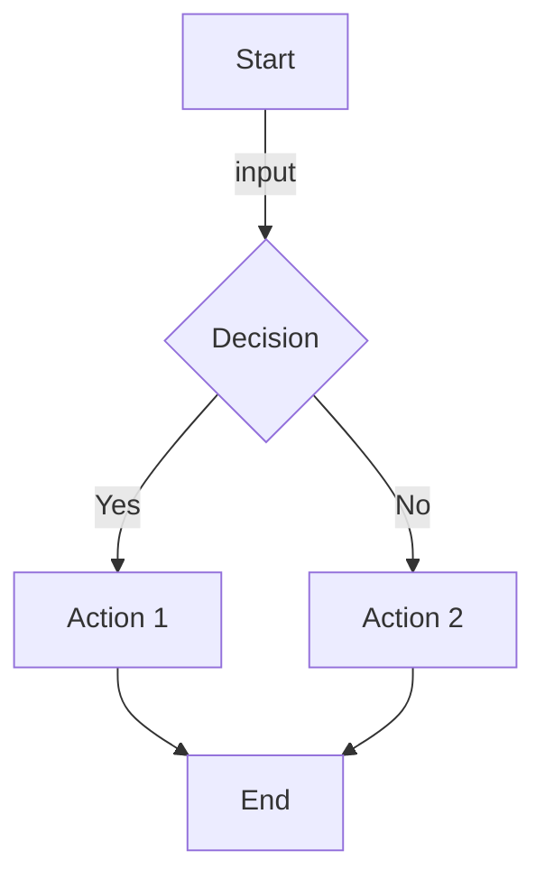
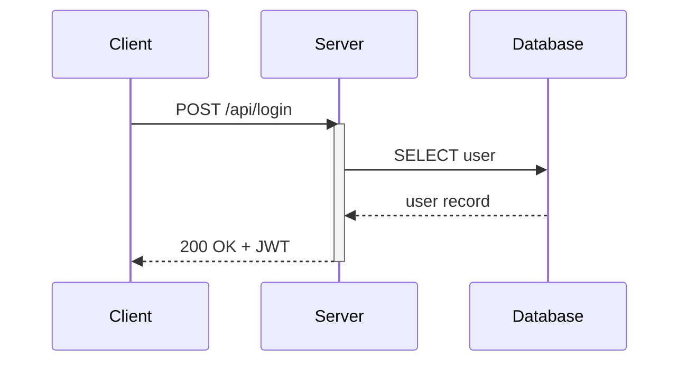
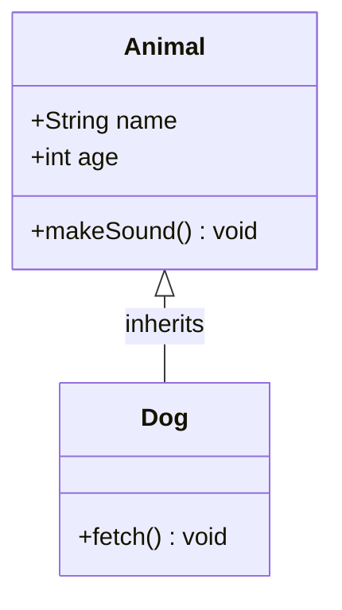
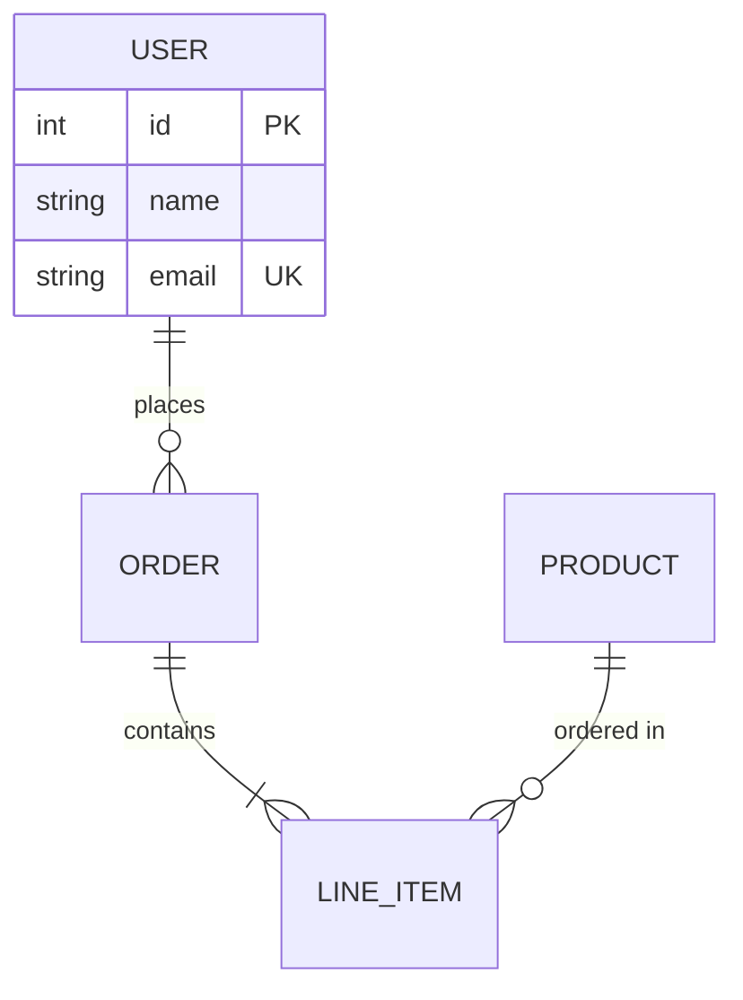
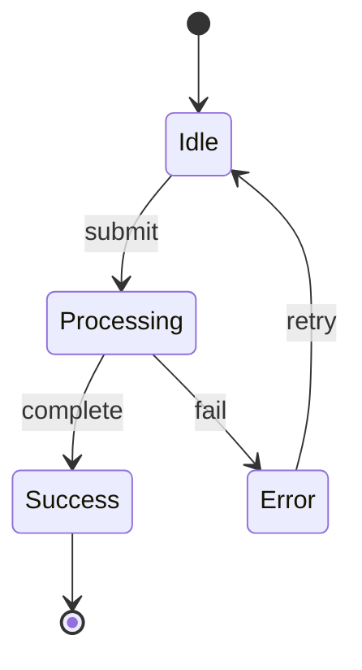
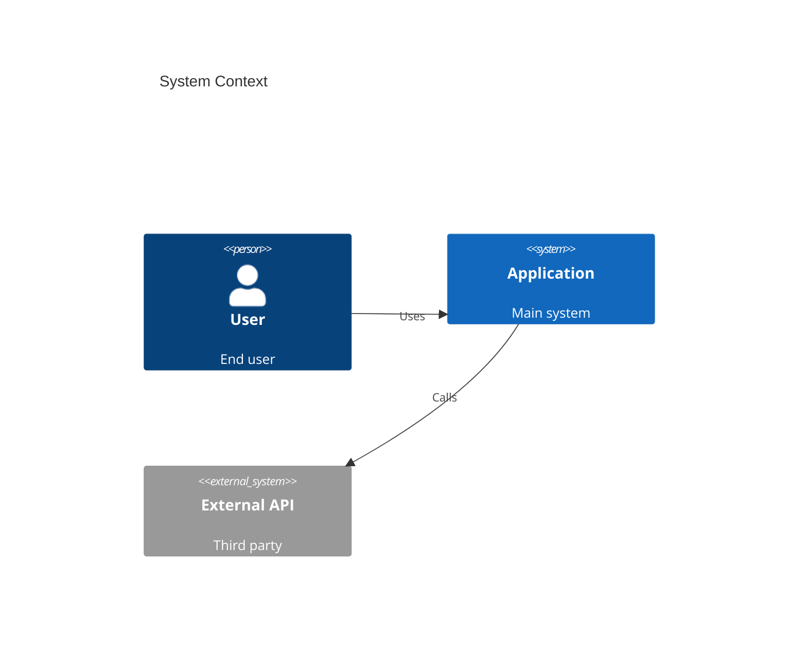
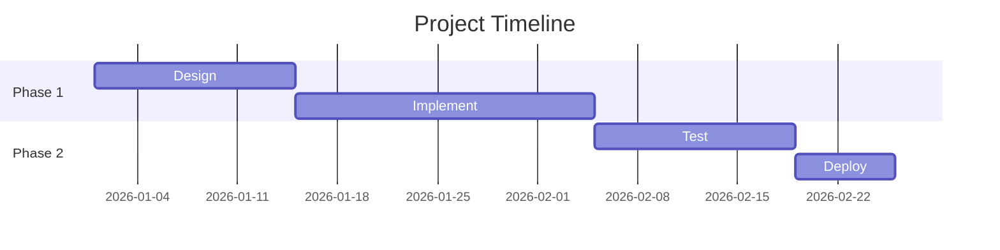

# Mermaid Diagram Type Reference

## Diagram Type Selection

| Type | Keyword | Use For |
|------|---------|---------|
| `flowchart` | `flowchart TD/LR` | Processes, decision trees, workflows |
| `sequenceDiagram` | `sequenceDiagram` | API calls, service interactions, protocols |
| `classDiagram` | `classDiagram` | OOP design, data models, relationships |
| `erDiagram` | `erDiagram` | Database schemas, entity relationships |
| `stateDiagram-v2` | `stateDiagram-v2` | State machines, lifecycles |
| `C4Context` | `C4Context` | System context, container views |
| `gantt` | `gantt` | Project timelines, schedules |
| `journey` | `journey` | User journeys, experience maps |
| `mindmap` | `mindmap` | Brainstorming, concept hierarchies |
| `pie` | `pie` | Proportional data |

## Flowchart



**Direction**: `TD` (top-down), `LR` (left-right), `BT`, `RL`
**Shapes**: `[rect]`, `(round)`, `{diamond}`, `([stadium])`, `[[subroutine]]`, `[(cylinder)]`, `((circle))`
**Links**: `-->`, `---`, `-.->`, `==>`, `--text-->`, `-->|text|`

## Sequence Diagram



**Arrows**: `->>` (solid), `-->>` (dotted), `-x` (cross), `-)` (async)
**Blocks**: `loop`, `alt/else`, `opt`, `par/and`, `critical`, `break`

## Class Diagram



**Relations**: `<|--` (inherit), `*--` (composition), `o--` (aggregation), `-->` (association), `..>` (dependency)

## ER Diagram



**Cardinality**: `||` (one), `o|` (zero or one), `}|` (one or more), `}o` (zero or more)

## State Diagram



## C4 Context



## Gantt Chart



## High-Contrast Styling (Required)

Always add these classDef styles for accessibility:

```
classDef default fill:#E8F4FD,stroke:#1B4F72,stroke-width:2px,color:#1B4F72
classDef highlight fill:#D4EFDF,stroke:#1E8449,stroke-width:2px,color:#1E8449
classDef warning fill:#FDEBD0,stroke:#B9770E,stroke-width:2px,color:#B9770E
classDef error fill:#FADBD8,stroke:#C0392B,stroke-width:2px,color:#C0392B
```
