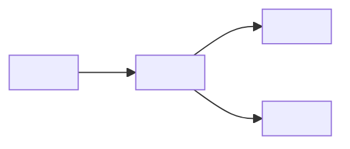

# Template — Option 5: Conference / Tech Talk

Loaded by SKILL.md when the routing matrix picks Option 5. Defines the 15-slide default sequence for a 30-minute conference talk, the declarative-heading rule (opposite of consulting action titles), the layout-rotation pattern, breadcrumb navigation, and the mandatory speaker-notes rule.

**Source**: PRD Section 6 Option 5. Synthesised from community patterns:
- **Layout rotation** — rotate through five layout types every 3–4 slides to prevent visual monotony.
- **Purpose detection** — pitch / teaching / conference / internal classification informs narrative arc selection in Level 2 (L2-T4).
- **Breadcrumb navigation** — section-aware header on every content slide for audience orientation.

**Arc pattern**: Hook → Context → Core → Deep Dive → Application → Takeaways.

---

## Structural rules (apply to every slide)

1. **Declarative topic headings — NOT action titles.** Conference talks inform, they do not persuade. Slide titles are topic-style headings that name what the slide is about. They are the opposite of consulting action titles.
   - GOOD (declarative, conference): `How we scaled the ingest pipeline`
   - BAD (action title, wrong for conference): `The ingest pipeline scaled 10x in Q4`
   - BAD (action title, wrong for conference): `We should adopt streaming ingest for Q1`
   - Rule of thumb: if the title sounds like a headline or a finding, it belongs in consulting. If it names a subject or a chapter, it belongs here.
2. **Never mix styles within a deck.** All 15 slides use declarative headings. Action titles break the conference register.
3. **Breadcrumb navigation on every content slide.** Slides 4–14 carry a breadcrumb header showing the current section name in the sequence established on slide 3 (Agenda). The breadcrumb is a small top-of-slide header like `Section 2 · Core content` that orients the audience without consuming slide real estate.
4. **Layout rotation every 3–4 slides.** Rotate through the five layout types below to maintain visual variety and prevent death-by-bullet-points. Do not use the same layout on more than three consecutive slides.
   - **text-only** — heading + short paragraph + at most three supporting bullets
   - **split image** — text left, image/screenshot right (or vice versa)
   - **code block** — heading + fenced code block with language hint + one-line takeaway
   - **diagram** — architecture diagram, flow chart, or data visualisation + one-line caption
   - **quote** — pull-quote from a source + attribution, used sparingly for emphasis
5. **One message per slide.** Each slide communicates one idea. Two points → two slides.
6. **Speaker notes are mandatory on every slide.** Per PRD Section 6 Option 5. Use the Marp HTML comment convention documented in `references/generation/marp-conventions.md`:
   ```
   <!-- speaker: One-to-three sentences the presenter reads or paraphrases. Include delivery cues, timing hints, and any demo/code callouts. -->
   ```
   Even the Title, Q&A, and Resources slides get speaker notes — they guide pacing.
7. **Title slide and Q&A slide use `_class: lead`.** All other slides use the default layout.

---

## Slide sequence (15 slides, default for a 30-minute talk)

The sequence below is fixed from PRD Section 6 Option 5. The section labels on slides 4–12 are set by the Level 2 narrative-arc answer (L2-T4) — see `references/interview/level2-conference.md` for the mapping (journey / teaching / research).

| # | Purpose | Default layout | Title style | Content structure |
|---|---------|----------------|-------------|-------------------|
| 1 | Title slide | `_class: lead` | Presentation title + speaker + event + date | `<!-- _class: lead -->` at top; title, one-line subtitle, speaker name, event name, date |
| 2 | Hook / problem statement | text-only (full-width statement) | Provocative question or statement framing the talk | A single line or short paragraph that hooks the audience. No bullets. Optionally a single striking number or quote |
| 3 | Agenda / roadmap | text-only (numbered list) | `Agenda` or a topic-style heading such as `What we'll cover` | Numbered list of 4–5 sections (Context → Core → Deep Dive → Application, plus Takeaways). This list becomes the breadcrumb source for slides 4–14 |
| 4 | Section 1 — Context / background (intro) | split image (text left, visual right) | Topic heading naming Section 1 | Breadcrumb: `Section 1 · Context`. Short paragraph setting the scene. **MUST** contain a split-image visual — see **Slide 4 visual mandate** below |
| 5 | Section 1 — Context / background (detail) | text-only or diagram | Topic heading naming a Section 1 sub-topic | Breadcrumb: `Section 1 · Context`. Two or three bullets or a simple diagram expanding the context |
| 6 | Section 2 — Core content (intro) | code block | Topic heading naming Section 2 | Breadcrumb: `Section 2 · Core`. Concept introduction plus a fenced code block (with language hint) or structural diagram. One-line takeaway |
| 7 | Section 2 — Core content (detail) | diagram | Topic heading naming a Section 2 sub-topic | Breadcrumb: `Section 2 · Core`. **MUST** contain a diagram — see **Slide 7 visual mandate** below |
| 8 | Demo / live example | split image (terminal or screenshot right) | Topic heading such as `Live demo` or the demo subject | Breadcrumb: `Section 2 · Core`. **MUST** contain a split-image visual — see **Slide 8 visual mandate** below. Speaker notes carry the demo script. If L2-T3 was "no demos", repurpose as Section 2 detail |
| 9 | Section 3 — Deep dive (intro) | diagram | Topic heading naming Section 3 | Breadcrumb: `Section 3 · Deep dive`. **MUST** contain a diagram or chart — see **Slide 9 visual mandate** below. Short framing paragraph |
| 10 | Section 3 — Deep dive (detail) | text-only or code block | Topic heading naming a Section 3 sub-topic | Breadcrumb: `Section 3 · Deep dive`. Bullets, a quote, or a second code block. Rotate layout away from the one used on slide 9 |
| 11 | Section 4 — Practical application (intro) | split image | Topic heading naming Section 4 | Breadcrumb: `Section 4 · Application`. **MUST** contain a split-image visual — see **Slide 11 visual mandate** below. Short framing paragraph |
| 12 | Section 4 — Practical application (detail) | quote or text-only | Topic heading naming a Section 4 sub-topic | Breadcrumb: `Section 4 · Application`. Supporting pull-quote from a user or team, or an additional step-by-step detail |
| 13 | Key takeaways | text-only (numbered list, 3–5 items) | `Key takeaways` or a topic-style heading | Numbered list of 3–5 takeaway statements. Each takeaway is one line. No sub-bullets |
| 14 | Resources / links | text-only (list of URLs) | `Resources` or `Further reading` | URLs, repos, documentation links, related talks. Keep to 5–8 items |
| 15 | Q&A / Thank you | `_class: lead` | `Questions?` or `Thank you` | `<!-- _class: lead -->` at top; contact info (email, social handles), slide deck URL if applicable |

---

## Visual mandates (mandatory skeletons per visual slide)

Visual-layout slides MUST contain the specified skeleton. The generator MUST NOT emit a visual slide without it.

### Slide 4 visual mandate (split-image)

MUST contain: `` with an appendix back-reference.

```markdown


*[See Appendix: P1 — Context visual]*
```

Appendix row: `| P1 | 4 | **Context visual** — Timeline, screenshot, or photo. Right 40% composition. Key elements: <infer from source>. Conference theme style, anchors the context section. | excalidraw-diagram |`

### Slide 7 visual mandate (diagram)

MUST contain a mermaid fence skeleton. Replace labels with inferred content:

````markdown

````

One-line caption below the diagram is mandatory.

### Slide 8 visual mandate (split-image / demo)

MUST contain: `` with an appendix back-reference.

```markdown


*[See Appendix: P<n> — Demo screenshot]*
```

Appendix row: `| P<n> | 8 | **Demo screenshot** — Terminal output or running demo. Right 50% composition. Key elements: <infer from demo>. Technical style, provides concrete proof of the demo. | excalidraw-diagram |`

### Slide 9 visual mandate (diagram or chart)

MUST contain either a mermaid fence or a chart fence:

````markdown

````

Or: `` ```chart {type: bar, data: {labels: ["<infer>","<infer>","<infer>"], values: [10,20,30]}, title: "<infer>"} ``` ``

### Slide 11 visual mandate (split-image)

MUST contain: `` with an appendix back-reference.

```markdown


*[See Appendix: P<n> — Before/after visual]*
```

Appendix row: `| P<n> | 11 | **Before/after visual** — Step-by-step illustration. Left 40% composition. Key elements: <infer from source>. Practical style, shows how to apply the concept. | excalidraw-diagram |`

---

## Layout rotation sequence

Walking down the 15 slides, the default layout rotation is:

```
1  title     (lead)
2  text-only (hook)
3  text-only (agenda)
4  split-image
5  text-only
6  code-block
7  diagram
8  split-image (demo)
9  diagram
10 text-only
11 split-image
12 quote
13 text-only (takeaways)
14 text-only (resources)
15 lead (Q&A)
```

This rotation satisfies the layout variety rule — no more than three consecutive slides use the same layout family, and every layout type appears at least once in the deck. If a narrative-arc swap (L2-T4) changes the section labels, the rotation stays the same; only the section labels on slides 4–12 change.

---

## Breadcrumb navigation

Every content slide (4–14) carries a breadcrumb header naming the current agenda section. The breadcrumb sits above the slide title in smaller, muted text so it orients without dominating.

Marp convention (to be formalised in `references/generation/marp-conventions.md`):

```markdown
<!-- class: breadcrumb -->

###### Section 2 · Core

# How we scaled the ingest pipeline

Content body here.

<!-- speaker: Transition from Section 1 context into the core. Mention the 10x throughput result up front so the audience knows where this section lands. -->
```

The theme's CSS styles the `h6` at the top of a breadcrumb-class slide as a small, muted header. The agenda list on slide 3 is the canonical source of section names — keep them identical.

---

## Title-only test

After generating all 15 slides, read just the titles in order. The result should read like a coherent table of contents for a talk:

```
1.  [Talk title]
2.  [Hook — a question or framing statement]
3.  What we'll cover
4.  Where we started
5.  What the data looked like
6.  How the new pipeline is structured
7.  The ingest flow in one diagram
8.  Live demo — running a real workload
9.  Where the bottlenecks actually lived
10. Three things the benchmarks taught us
11. How to apply this in your own stack
12. What our users told us afterwards
13. Key takeaways
14. Resources
15. Questions?
```

If the title-only read sounds like a pitch or a set of findings, the titles have drifted into action-title territory — rewrite them as topic headings.

---

## Speaker-notes template

Per PRD Section 6 Option 5, every slide gets speaker notes. Minimum content per slide:

```
<!-- speaker:
- Timing: ~2 minutes on this slide.
- Key point: [one line summarising what the presenter says].
- Delivery cue: [transition, demo trigger, audience question, or pacing note].
-->
```

The scoring gate rejects any conference deck where a content slide is missing speaker notes.

---

## Compression rules

If L2-T2 (duration + slide count guidance) forces a shorter deck:

- **12 slides** — drop slide 14 (Resources — move links into speaker notes on slide 13) and merge slides 5 and 10 into their intro slides (4 and 9).
- **10 slides** — additionally merge slides 11 and 12 into a single Section 4 slide and drop slide 8 unless L2-T3 kept demos.
- **8 slides (lightning talk)** — Title → Hook → Agenda → Section 1 → Section 2 → Section 3 → Takeaways → Q&A.
- **Below 6 slides** — refuse and explain the minimum; lightning-talk floor is 6 slides (Title → Hook → one section → Takeaways → Resources → Q&A).

If L2-T2 allows a longer talk (45–60 minutes), extend by inserting additional detail slides inside Sections 2 and 3 using the same layout-rotation rule.

---

## Interaction with SKILL.md routing

SKILL.md already recommends Option 5 when Level 1 Q4 (goal) is **Informing** and Level 1 Q2 (audience) contains any of: `conference`, `meetup`, `community`, `developers`. No routing change is required in batch 3 — the matrix was populated in batch 1. This template file is loaded only after that recommendation has been accepted (or the user has explicitly chosen Option 5 from the framework menu).
