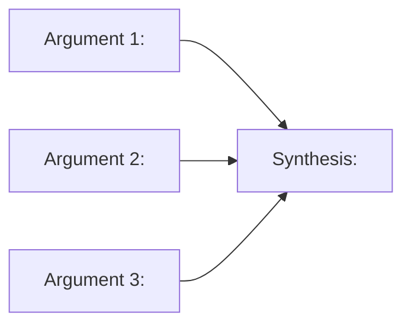

# Template — Option 1: McKinsey Pyramid Principle

Loaded by SKILL.md when the routing matrix picks Option 1. Defines the 12-slide sequence, the action-title rule, the one-message-per-slide rule, and the SCR (Situation / Complication / Resolution) executive-summary opening.

**Source**: Community ppt-creator (Pyramid Principle methodology), extended with SCR (Situation-Complication-Resolution) narrative opening.

**Arc pattern**: Answer → Argument 1 + Evidence → Argument 2 + Evidence → Argument 3 + Evidence → Synthesis → Recommendation.

---

## Structural rules (apply to every slide)

1. **Action titles.** Every slide title is a complete sentence stating a finding or conclusion, not a topic label.
   - BAD: `Market Analysis`
   - GOOD: `The European market grew 23% in Q4, outpacing all other regions`
2. **One message per slide.** Each slide communicates exactly one idea. If you have two points, you need two slides.
3. **Source every data point.** Unsourced numbers lose credibility. Cite from the working notes via a trailing `<!-- Source: ... -->` comment (see `references/generation/marp-conventions.md`).
4. **Title-only test.** Reading just the slide titles in sequence should tell the full story.
5. **Title slide uses `_class: lead`.** All other slides use the default layout.

---

## Slide sequence (12 slides)

| # | Purpose | Title style | Content structure |
|---|---------|-------------|-------------------|
| 1 | Title slide | Presentation title + subtitle + author + date | `<!-- _class: lead -->` at top; title, one-line subtitle, author, date |
| 2 | Executive Summary (SCR) | Action title stating the recommendation | **Situation** (2 lines) → **Complication** (2 lines) → **Resolution** (the recommendation). This is the SCR pattern from the SCPR framework, abbreviated |
| 3 | Argument 1 | Action title stating the first supporting argument | One-paragraph framing of the argument plus an `[DATA NEEDED: ...]` or CHART placeholder |
| 4 | Argument 1 — evidence | Action title stating the insight from the data | **MUST** contain a chart, mermaid, or image skeleton — see **Slide 4/6/8 visual mandate** below; cite source |
| 5 | Argument 2 | Action title stating the second supporting argument | Framing paragraph plus chart/data placeholder |
| 6 | Argument 2 — evidence | Action title stating the insight | **MUST** contain a chart, mermaid, or image skeleton — see **Slide 4/6/8 visual mandate** below; cite source |
| 7 | Argument 3 | Action title stating the third supporting argument | Framing paragraph plus chart/data placeholder |
| 8 | Argument 3 — evidence | Action title stating the insight | **MUST** contain a chart, mermaid, or image skeleton — see **Slide 4/6/8 visual mandate** below; cite source |
| 9 | Synthesis | Action title connecting all three arguments | How the three arguments combine to support the overall recommendation (MECE check). SHOULD contain a mermaid diagram — see **Slide 9 visual mandate** below |
| 10 | Recommendation | Action title restating the ask with specificity | Clear next steps with owners and timeline |
| 11 | Risk / mitigation (optional) | Action title on the key risk | Mitigation plan; omit if no material risk |
| 12 | Appendix marker | `Appendix` (topic label allowed here only) | Supporting data, methodology, detailed tables |

---

## Slide 1 — Title slide template

```markdown
---
marp: true
theme: consulting
paginate: true
---

<!-- _class: lead -->

# [Presentation title]

[One-line subtitle stating the ask or the finding]

[Author] · [Date]
```

The `_class: lead` directive centres the content and invokes the theme's lead-slide variant. Only slide 1 (and any explicit section dividers) uses `_class: lead`.

---

## Slide 2 — Executive Summary (SCR)

The SCR pattern compresses the SCPR framework (Situation → Complication → Problem → Recommendation) to three beats, keeping the Recommendation visible on the first content slide. This matches McKinsey's "answer first" rule.

```markdown
# [Action title that IS the recommendation]

**Situation.** [Two lines describing the current state the audience understands]

**Complication.** [Two lines describing what has changed or what is now at stake]

**Resolution.** [The recommendation in one sentence, followed by the three supporting arguments that the rest of the deck will unpack]

<!-- speaker: Deliver the recommendation in the first 30 seconds. The next three arguments appear on slides 3, 5, and 7 with their evidence slides in between. -->
```

Slides 3–8 then each unpack one argument with its evidence, slide 9 synthesises them, slide 10 restates the recommendation with specificity, slide 11 covers the main risk, and slide 12 flags the appendix.

---

## Visual mandates (mandatory skeletons per evidence slide)

Evidence slides (4, 6, 8) and the synthesis slide (9) MUST contain visual skeletons. The generator MUST NOT emit these slides with only text — each MUST include at least one of the skeleton types below.

### Slide 4/6/8 visual mandate (evidence)

Each evidence slide MUST contain one of these skeleton types, chosen based on the argument's data:

**Option A — Chart fence** (use for quantified data, comparisons, trends):

````markdown
```chart
{type: bar, data: {labels: ["<infer>","<infer>","<infer>"], values: [10,20,30]}, title: "<infer from argument>"}
```
````

**Option B — Mermaid fence** (use for process flows, cause-effect, timelines):

````markdown

````

**Option C — Image placeholder** (use when evidence is a photo, screenshot, or external graphic):

```markdown


*[See Appendix: P<n> — Evidence visual for Argument N]*
```

Appendix row: `| P<n> | <slide> | **Evidence visual for Argument N** — Centred 700px composition. Key elements: <infer from source>. Consulting style, provides visual proof for the argument. | excalidraw-diagram |`

### Slide 9 visual mandate (synthesis)

Slide 9 SHOULD contain a mermaid diagram showing how the three arguments connect to support the recommendation:

````markdown

````

---

## Title-only test

After generating all 12 slides, read just the titles in order. The result should read like a coherent pitch:

```
1.  [Deck title]
2.  We should do X because A, B, and C.
3.  A matters because [evidence summary].
4.  The data shows [specific finding].
5.  B matters because [evidence summary].
6.  The data shows [specific finding].
7.  C matters because [evidence summary].
8.  The data shows [specific finding].
9.  Together, A, B, and C mean X is the right answer.
10. We recommend X — starting on [date] with [owner].
11. The main risk is Y, mitigated by Z.
12. Appendix.
```

If the title-only read doesn't flow, revisit the action titles.

---

## MECE check

Before handing to the scoring gate, verify the three arguments are:
- **Mutually Exclusive** — no overlap between A, B, and C.
- **Collectively Exhaustive** — no major supporting reason missing.

If overlap exists, merge or redraw the argument boundary. If a gap exists, add a fourth argument and extend to 14 slides.

---

## Compression rules

If Q5 constrained the deck to fewer than 12 slides:
- First to drop: slide 11 (risk/mitigation).
- Next: merge slides 3+4, 5+6, 7+8 (argument with inline evidence) to land at 9 slides.
- Minimum: 6 slides — title + SCR + three merged argument/evidence + recommendation.
- Below 6, refuse and explain the minimum.
