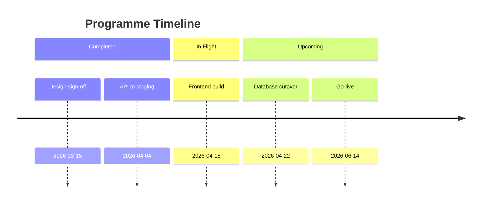
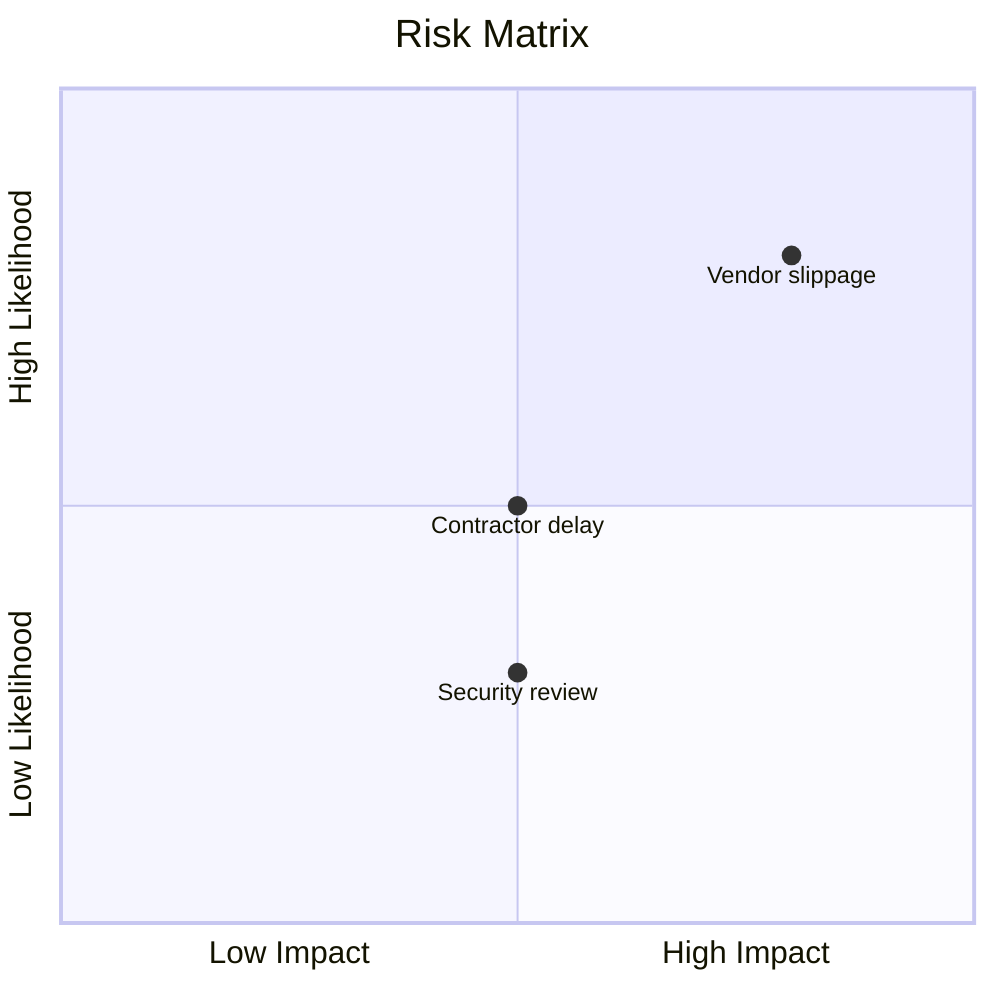

# Template — Option 7: Steering Committee / Board Pack

**Source**: Novel — no existing SKILL.md covers this. Structural patterns derived from Mary Beth Hazeldine's decision-first 10-slide architecture (24 years JPMorgan / PwC / RBS programme reporting), Tactical Project Manager's 5-slide status template scaled up, Expert Programme Management's RAID framework, Zamartz's per-workstream operational variant, BestOutcome's portfolio heatmap model, and SlideModel's RAID layout conventions.

**Use when**: Level 1 routing lands on Option 5 — the audience is a steering committee, programme board, directors, or any governance body that must **approve, fund, or redirect**. The presentation is decisional, not informational.

---

## Structural rules

- **Decision-first ordering.** The ask appears on **slide 3**, before the evidence — not on slide 9 where traditional status decks hide it. Executives see the decision required early, then evaluate supporting data. This is the single most important rule of the template.
- **The "if time gets cut" survival rule.** A 30-minute slot often shrinks to 10 minutes in real governance meetings. If that happens, slides **1, 2, 3, 6, 9, 10** must survive as the decision path: Title → Exec Summary → Decision Required → Risk & Issues → Recommendation → Forward Look. The skill documents this on slide 3 as a speaker note so the presenter knows which slides they can drop if forced.
- **Per-dimension RAG, not overall.** Unlike Option 4 (which uses a single overall RAG), Option 5 rates **each dimension individually**: Schedule / Budget / Scope / Resources / Risk / Quality. This is what turns a status read into a governance view.
- **Budget variance, not just budget.** Every financial table shows **budget vs actual** with an explicit variance column. A budget number alone is not acceptable — governance bodies need to see drift.
- **Action titles throughout.** Same consulting-style rule as Option 4: "Programme is 2 weeks behind schedule due to vendor delay" — not "Schedule Status".
- **Per-workstream sub-slides when >1 workstream.** If L2-S3 returns more than one workstream, insert a sub-slide per workstream **between slide 4 (Programme Status Overview) and slide 5 (Financial Summary)**. Each sub-slide carries the same RAG dashboard scoped to that workstream. This is the Zamartz operational variant — it keeps the top-line overview clean while still giving the board auditability.
- **One message per slide.** Governance audiences stop reading at the first slide that tries to make two points.

## RAG standard

Identical to Option 4 (see `template-raid-status.md`): 🟢 on track · 🟡 at risk · 🔴 critical. Steering packs use these on every dimension, not just overall.

---

## Slide sequence (10 slides)

| # | Slide | Purpose | Content structure | Survives time cut? |
|---|-------|---------|-------------------|--------------------|
| 1 | **Title** | Orient the audience | Programme name · steering committee meeting date · overall health RAG · `<!-- _class: lead -->` | ✅ Yes |
| 2 | **Executive Summary** | One-look programme view | One-line per dimension with RAG: Overall / Schedule / Budget / Scope / Resources / Risk / Quality | ✅ Yes |
| 3 | **Decision Required** | The ask — **this is the whole point of the meeting** | Explicit approval / funding / direction / escalation request. Must include cost implication and timeline implication | ✅ Yes |
| 4 | **Programme Status Overview** | RAG dashboard across all workstreams | Table: Workstream / Phase / RAG / Key Update. If only 1 workstream, this becomes a single-row summary | ❌ Drop if time cut |
| 4a..4n | *Per-workstream sub-slides (if >1 workstream)* | Scoped detail for each workstream | Repeat the slide-2 dimension table but scoped to one workstream. Insert between slide 4 and slide 5 | ❌ Drop if time cut |
| 5 | **Financial Summary** | Budget vs actual with variance | **MUST** contain a chart skeleton — see **Slide 5 visual mandate** below. Plus table with variance and burn rate | ❌ Drop if time cut |
| 6 | **Risk & Issues** | Top 3–5 items needing governance attention | Table: Description / Impact / Likelihood / Owner / Mitigation Status / RAG. Sort by impact × likelihood. SHOULD contain a mermaid diagram — see **Slide 6 visual mandate** below | ✅ Yes |
| 7 | **Milestones & Timeline** | Where we are on the plan | **MUST** contain a mermaid timeline — see **Slide 7 visual mandate** below. Plus milestone lists | ❌ Drop if time cut |
| 8 | **Dependencies** | Cross-programme items requiring awareness | Table: Dependency / Owner / Dependent programme / Status / Date. Anything blocking or at risk of blocking | ❌ Drop if time cut |
| 9 | **Recommendation** | Clear recommended path | If options exist, present 2–3 with pros / cons / cost / timeline. Otherwise a single clear recommendation | ✅ Yes |
| 10 | **Forward Look** | What to expect by next meeting | Next 3 milestones with dates. Key activities for next reporting period. Date of next steering committee | ✅ Yes |

**Survival path under time pressure:** 1 → 2 → 3 → 6 → 9 → 10. Six slides, roughly 10 minutes, preserves the decision path. The skill must note this explicitly on slide 3's speaker notes.

---

## Why slide 3 is not slide 9

Traditional programme reports put the recommendation at the end — slide 9 or later — because that's where the argument "concludes". Mary Beth Hazeldine's 24 years of senior programme reporting at JPMorgan, PwC, and RBS taught her the opposite: **governance audiences need the ask first**, then the evidence, because:

1. **Meetings get cut short.** If the chair moves the meeting to 10 minutes, you need the decision visible before the evidence. A decision on slide 9 dies when slide 9 never gets shown.
2. **Executives read deks backwards.** They skip to the recommendation, then look for justification. Putting the ask on slide 3 matches their reading pattern.
3. **Evidence becomes targeted.** Once the audience knows the ask, slides 4–8 become "here is the evidence for that specific decision" instead of "here is everything about the programme".
4. **No surprise endings.** Surprising a steering committee with a decision at slide 9 is how requests get deferred. An early ask gives the audience time to react in the room.

The skill must generate slide 3 as an explicit, standalone decision slide — not buried as a bullet in the exec summary.

---

## Slide-by-slide content templates

### Slide 1 — Title

```markdown
<!-- _class: lead -->

# Programme Atlas — 🟡 amber, decision needed on vendor change

**Steering Committee — April 2026**
Meeting date: 2026-04-14 · Programme Director: Pete McAllister

<!-- Speaker notes: Open with the overall RAG and hint at the decision. This is the hook for the meeting. -->
```

### Slide 2 — Executive Summary

```markdown
# Programme is 🟡 amber overall, driven by schedule slippage on vendor integration

| Dimension | RAG | One-line status |
|-----------|-----|-----------------|
| Overall | 🟡 | Amber — schedule slippage compensable with vendor change |
| Schedule | 🔴 | 2 weeks behind due to Vendor X integration delay |
| Budget | 🟢 | 42% spent; forecast £12k under budget |
| Scope | 🟢 | No change requests approved this period |
| Resources | 🟡 | Contractor onboarding delayed 1 week |
| Risk | 🟡 | Vendor dependency remains top concern |
| Quality | 🟢 | All gates passed; zero defects on staging |

<!-- Speaker notes: Pause on 🔴 and 🟡 rows. Do not defend them yet — the decision slide is next. -->
```

Every dimension has its own RAG. This is the hallmark of a steering pack.

### Slide 3 — Decision Required (THE CORE SLIDE)

```markdown
# We request approval to change integration vendor at a cost of £200k to avoid a 6-week slip

## Decision requested
Approve replacement of Vendor X with Vendor Y for the integration workstream, effective 2026-04-21.

## Cost implication
- One-off switching cost: **£200k** (within programme contingency of £250k)
- Net budget impact: **£188k favourable** versus original plan after cancelling Vendor X residual contract (£12k recovery)

## Timeline implication
- With change: **June delivery holds** (slide 7 timeline unchanged)
- Without change: **6-week slip** — go-live moves from 2026-06-14 to 2026-07-26

## Alternative
Do nothing and accept the 6-week slip. Not recommended — see slide 9 for full options comparison.

<!-- Speaker notes: If the meeting gets cut to 10 minutes, the survival path is slides 1, 2, 3, 6, 9, 10. This slide is mandatory — do not advance past it without a decision. -->
```

The `decision-required block with cost and timeline implications` phrase is exactly what the behave scenario asserts is present on slide 3. The slide 3 speaker note carries the survival-path rule so the presenter can respond to a time cut.

### Slide 4 — Programme Status Overview

```markdown
# Three of four workstreams are 🟢; integration workstream is 🔴 pending vendor decision

| Workstream | Phase | RAG | Key Update |
|------------|-------|-----|------------|
| Platform | Build | 🟢 | API v2 deployed to staging on plan |
| Integration | Build | 🔴 | Vendor X slippage — see decision slide |
| Data | Design | 🟢 | Schema sign-off complete |
| Frontend | Design | 🟡 | Designer capacity tight but recoverable |

<!-- Speaker notes: If there's only one workstream this slide becomes trivial — collapse to one row. If there are more than one, insert per-workstream sub-slides 4a..4n after this slide. -->
```

**Per-workstream sub-slide pattern (when L2-S3 > 1).** For each workstream, insert a slide between slide 4 and slide 5 that carries the same dimension table as slide 2 but scoped to that workstream. Title them `4a`, `4b`, etc., so the audience knows they are drill-downs of slide 4.

### Slide 5 — Financial Summary

```markdown
# Budget is 🟢 with £12k favourable variance; vendor change would drop that to £188k favourable

| Category | Budget | Actual | Variance | Forecast | RAG |
|----------|--------|--------|----------|----------|-----|
| Platform build | £80k | £78k | +£2k | £80k | 🟢 |
| Integration | £60k | £52k | +£8k | £60k | 🟡 |
| Data | £20k | £18k | +£2k | £20k | 🟢 |
| Frontend | £20k | £20k | £0 | £22k | 🟡 |
| **Total** | **£180k** | **£168k** | **+£12k** | **£182k** | **🟢** |

**Burn rate:** £12k/week, consistent with plan.
**Variance explanation:** £12k favourable driven by Integration workstream under-spend due to Vendor X delay. Funds will partially offset the vendor change cost on slide 3.

<!-- Speaker notes: Always show variance. A budget without variance is not a governance view — it's a press release. -->
```

The table has a **Variance** column. That's the non-negotiable bit of the financial view.

#### Slide 5 visual mandate (financial summary)

In addition to the variance table, slide 5 MUST contain a chart fence skeleton showing budget vs actual:

````markdown
```chart
{type: bar, data: {labels: ["Platform","Integration","Data","Frontend"], values: [80,60,20,20]}, title: "Budget vs Actual (£k)"}
```
````

Use a grouped bar pattern with budget and actual side-by-side. Labels and values MUST be inferred from the source material.

#### Slide 7 visual mandate (milestones & timeline)

Slide 7 MUST contain a mermaid timeline skeleton showing the project milestones:

````markdown

````

Milestone names and dates MUST be inferred from the source material.

#### Slide 6 visual mandate (risk & issues — optional)

Slide 6 SHOULD contain a mermaid quadrant chart for impact/likelihood mapping. If quadrant syntax is too complex for the content, keep the styled HTML table as the primary visual:

````markdown

````

### Slide 6 — Risk & Issues

```markdown
# Top three risks concentrate on vendor and resource exposure

| ID | Description | Impact | Likelihood | Owner | Mitigation | RAG |
|----|-------------|--------|------------|-------|------------|-----|
| R-17 | Vendor X integration slippage | H | H | Pete | Vendor change proposed (slide 3) | 🔴 |
| R-22 | Contractor onboarding delay | M | M | Laura | Interim coverage from Platform team | 🟡 |
| R-31 | Security review dependency slip | M | L | Ops | Early submission 2026-04-09 | 🟢 |

<!-- Speaker notes: Slide 6 survives the time cut — it is the evidence for slide 3. Keep it tight at 3–5 rows. -->
```

### Slide 7 — Milestones & Timeline

```markdown
# Timeline holds for June delivery contingent on vendor decision today

**✅ Completed**
- 2026-03-15 — Design sign-off
- 2026-04-04 — API v2 to staging
- 2026-04-08 — Security review passed

**🔵 In flight**
- Frontend build (Laura) — due 2026-04-18
- Integration spike (Pete) — due 2026-04-21 ← dependent on slide 3 decision

**⏭️ Upcoming**
- 2026-04-22 — Database cutover
- 2026-05-01 — UAT kick-off
- 2026-06-14 — Go-live

<!-- Speaker notes: Consider rendering this as a Gantt visual for PPTX/HTML output. -->
```

### Slide 8 — Dependencies

```markdown
# Two cross-programme dependencies require awareness from this committee

| Dependency | Owner | Dependent programme | Status | Date |
|------------|-------|---------------------|--------|------|
| Shared SSO cutover | Infosec | Programme Bravo | 🟡 Slipping 1 week | 2026-04-28 |
| Finance data feed | FinOps | Programme Charlie | 🟢 On plan | 2026-05-02 |

<!-- Speaker notes: These are not things we control. Flag them so the committee can cross-chase if needed. -->
```

### Slide 9 — Recommendation

```markdown
# We recommend Option A (vendor change) — it preserves June delivery and saves £188k vs the alternative

## Option A — Change vendor (**recommended**)
- **Pros:** Preserves June delivery · £188k net favourable · proven vendor in other programmes
- **Cons:** One-off £200k switching cost · 1-week transition risk
- **Cost:** £200k one-off · **Timeline:** June holds

## Option B — Accept slippage
- **Pros:** Zero switching cost · no transition risk
- **Cons:** 6-week slip · knock-on impact to UAT and training · reputational cost with business sponsor
- **Cost:** £0 direct · **Timeline:** Go-live moves to July 26

## Option C — Split workstream across both vendors
- **Pros:** Risk diversification
- **Cons:** Doubles coordination overhead · no material schedule benefit
- **Cost:** £120k · **Timeline:** 3-week slip · Not recommended

<!-- Speaker notes: If the audience has already agreed on slide 3, walk slide 9 at speed. If they haven't, this is where you argue the case. -->
```

### Slide 10 — Forward Look

```markdown
# Next three milestones land before the May steering; next meeting 2026-05-12

**Next 3 milestones**
- 2026-04-22 — Database cutover
- 2026-05-01 — UAT kick-off
- 2026-05-08 — UAT first pass complete

**Key activities this period**
- Execute vendor transition (if approved today)
- Close out contractor onboarding
- Begin UAT preparation with business sponsor

**Next steering committee:** 2026-05-12

<!-- Speaker notes: Always end with the date of the next meeting. It closes the governance loop. -->
```

---

## Arc pattern

`Title → Exec summary → **DECISION** → Status → Workstream drill-downs → Financials → Risks → Timeline → Dependencies → Recommendation → Forward look`

Read only the titles and you get the whole meeting: "Amber programme, decision needed → Here's the top-line → Here's the ask → Here's the status → Here's the money → Here are the risks → Here's the plan → Here's who we depend on → Here's what we recommend → Here's what's next."

## What this template deliberately includes that Option 4 omits

- Per-dimension RAG (7 dimensions, not 1)
- Explicit budget-vs-actual variance
- Dedicated decision slide at position 3
- Per-workstream drill-down pattern
- Cross-programme dependencies
- Multi-option recommendation comparison
- Forward-look calendar

If the audience doesn't need these, they don't need Option 5 — use Option 4 instead.
