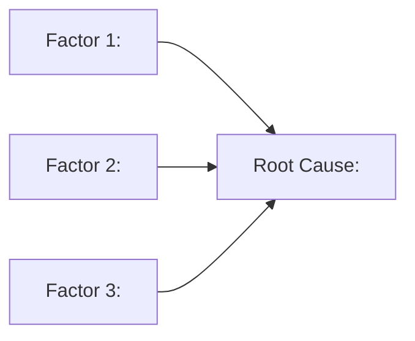

# Template — Option 3: Internal Problem-Solving / Issue Tree

Loaded by SKILL.md when the routing matrix picks Option 3. Defines the 13-slide sequence for internal root-cause analysis and solution-recommendation decks — the classic McKinsey issue-tree shape.

**Source**: Community enterprise-ai-skills storyline-builder Template 2 (adapted). Extended with action-title discipline and one-message-per-slide rules from the Pyramid Principle.

**Arc pattern**: **Problem → Contributing Factors (×3 with sizing) → Root Cause → Solutions (×3) → Recommendation**

---

## Structural rules (apply to every slide)

1. **Action titles.** Every slide title is a complete sentence stating a finding, not a topic label.
   - BAD: `Factor 1: Process Delays`
   - GOOD: `Process delays account for 42% of the gap — the largest single contributor`
2. **One message per slide.** Each slide communicates exactly one idea.
3. **Quantify every factor.** If a contributing factor cannot be sized, flag it `[DATA NEEDED: sizing]` — do not ship an unquantified issue tree.
4. **MECE factors.** The 3 contributing factors must be Mutually Exclusive and Collectively Exhaustive. Overlap or gaps fail criterion 4 (MECE coverage) in the scoring rubric.
5. **Title slide uses `_class: lead`.**

---

## Slide sequence (13 slides)

| # | Purpose | Title style | Content structure |
|---|---------|-------------|-------------------|
| 1 | Title | Problem name + date | `<!-- _class: lead -->`; problem name, one-line framing, author, date |
| 2 | Problem statement | Action title stating the gap | Current state vs. target state with quantified gap; chart placeholder |
| 3 | Contributing factor 1 | Action title stating factor 1 | Description + evidence; cite source |
| 4 | Factor 1 impact | Action title stating factor 1's share of the gap | **MUST** contain a chart skeleton — see **Slide 4/6/8 visual mandate** below |
| 5 | Contributing factor 2 | Action title stating factor 2 | Description + evidence; cite source |
| 6 | Factor 2 impact | Action title stating factor 2's share | **MUST** contain a chart skeleton — see **Slide 4/6/8 visual mandate** below |
| 7 | Contributing factor 3 | Action title stating factor 3 | Description + evidence; cite source |
| 8 | Factor 3 impact | Action title stating factor 3's share | **MUST** contain a chart skeleton — see **Slide 4/6/8 visual mandate** below |
| 9 | Root cause insight | Action title stating the synthesis | **MUST** contain a mermaid diagram — see **Slide 9 visual mandate** below |
| 10 | Solution option A | Action title stating option A's claim | Impact / investment / timeline table |
| 11 | Solution option B | Action title stating option B's claim | Impact / investment / timeline table |
| 12 | Solution option C | Action title stating option C's claim | Impact / investment / timeline table |
| 13 | Prioritisation + recommendation | Action title restating the ask | Why option X, phased implementation, success metrics, owners |

---

## Slide 1 — Title slide template

```markdown
---
marp: true
theme: consulting
paginate: true
---

<!-- _class: lead -->

# [Problem name — e.g. "Why new-customer onboarding takes 47 days"]

[One-line framing of the problem and its business impact]

[Author] · [Date]
```

---

## Slide 2 — Problem statement template

```markdown
# [Action title stating the gap — e.g. "Onboarding takes 47 days today vs a 14-day target, costing $3.2M/year"]

| State | Current | Target | Gap |
|-------|---------|--------|-----|
| [Metric, e.g. days to onboard] | 47 | 14 | -33 |

**Impact.** [One-line statement of the business cost of the gap]

<!-- Source: [working-notes item] -->
```

---

## Slide 4/6/8 — Factor-impact template

Each factor's impact slide should size the factor's contribution **as a percentage of the total gap**, so the three impact numbers add to ~100%:

```markdown
# [Action title — e.g. "Process delays account for 42% of the 33-day gap"]

[Chart placeholder: stacked bar or waterfall showing factor 1 as 42% of the gap]

- Current: [specific number]
- Contribution to gap: **42%**
- Evidence: [data point + source]

<!-- Source: [working-notes item] -->
```

---

## Visual mandates (mandatory skeletons per visual slide)

Slides 4, 6, 8 (factor impact) and slide 9 (root cause) MUST contain visual skeletons. The generator MUST NOT emit these slides with only text.

### Slide 4/6/8 visual mandate (factor impact)

Each factor-impact slide MUST contain a chart fence skeleton showing the factor's contribution to the gap:

````markdown
```chart
{type: bar, data: {labels: ["Factor 1","Factor 2","Factor 3"], values: [42,33,25]}, title: "Contribution to Gap (%)"}
```
````

The chart MUST use values that reflect the quantified sizing for each factor. Labels and values MUST be inferred from the source material.

### Slide 9 visual mandate (root cause insight)

Slide 9 MUST contain a mermaid diagram showing how the three factors lead to the root cause:

````markdown

````

---

## Slide 10/11/12 — Solution option template

```markdown
# [Action title — e.g. "Option A: automate the credit-check step would close 18 days of the gap for $240k"]

| Dimension | Value |
|-----------|-------|
| Expected impact | [e.g. 18 days / 55% of gap] |
| Investment | [e.g. $240k + 3 FTE-months] |
| Timeline | [e.g. 10 weeks to launch] |
| Risk | [e.g. vendor integration risk] |

<!-- Source: [working-notes item] -->
```

---

## Slide 13 — Prioritisation + recommendation

```markdown
# [Action title restating the ask — e.g. "We recommend Option A because it closes the largest share of the gap per dollar invested"]

| Option | Impact | Investment | ROI rank |
|--------|--------|-----------|----------|
| A | 55% | $240k | 1 |
| B | 30% | $380k | 2 |
| C | 15% | $180k | 3 |

**Recommended phasing.**
1. [Phase 1 — weeks 0–4]
2. [Phase 2 — weeks 5–10]
3. [Phase 3 — weeks 11+]

**Success metrics.** [Metric, target, measurement date]
**Owner.** [Name / team]
```

---

## MECE check

Before the scoring gate, verify the three contributing factors are:
- **Mutually Exclusive** — no overlap between factors 1, 2, and 3.
- **Collectively Exhaustive** — the sizing percentages add to ~100% of the gap. If they add to 80%, either there is a missing factor 4 or the sizing is wrong.

If MECE fails, redraw the factor boundaries or add a fourth factor and extend the deck to 15 slides.

---

## Compression rules

If Q5 constrained the deck to fewer than 13 slides:
- First to drop: merge slides 3+4, 5+6, 7+8 (factor with inline sizing) to land at 10 slides.
- Next: drop one of the three solution options if it is clearly dominated, landing at 8 slides.
- Minimum: 7 slides — title + problem + three merged factors + root cause + recommendation.
- Below 7, refuse and explain the minimum.

---

## Title-only test

Reading just the titles in order should tell the issue-tree story:

```
1.  [Problem name]
2.  The gap is X, costing $Y.
3.  Factor 1 is A.
4.  A accounts for 42% of the gap.
5.  Factor 2 is B.
6.  B accounts for 33% of the gap.
7.  Factor 3 is C.
8.  C accounts for 25% of the gap.
9.  Together, A/B/C reveal root cause R.
10. Option A closes 55% of the gap for $240k.
11. Option B closes 30% for $380k.
12. Option C closes 15% for $180k.
13. We recommend Option A, phased over 10 weeks.
```

If the title-only read doesn't flow, revisit the action titles.
