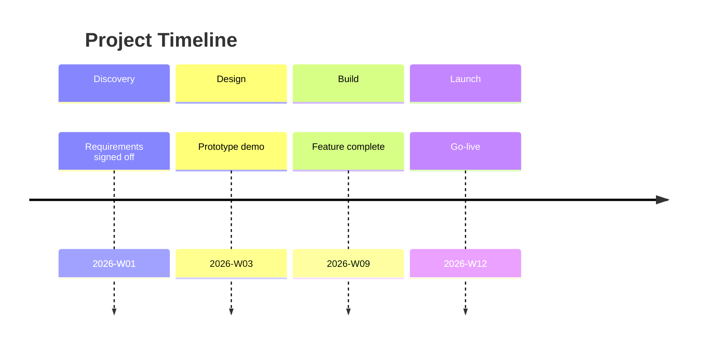

# Template — Option 4: Project Roadmap / Implementation Plan

Loaded by SKILL.md when the routing matrix picks Option 4 (either explicit selection or the "constraint mentions roadmap/implementation/plan" override row). Defines the 6-slide sequence for project kickoff decks, implementation plans, and delivery roadmaps.

**Source**: Community enterprise-ai-skills storyline-builder Template 3 (adapted). Extended with action-title discipline so the roadmap is a set of claims, not a set of topics.

**Arc pattern**: **Objective → Approach → Roadmap → Team → Success**

---

## Structural rules (apply to every slide)

1. **Action titles.** Every slide title is a complete sentence stating a claim, not a topic label.
   - BAD: `Team Composition`
   - GOOD: `Delivering on time requires 2 engineers and 1 PM from week 2`
2. **One message per slide.**
3. **Dates and durations, not vague phases.** Every phase has a start date, end date, duration in weeks, and a named owner.
4. **Measurable success criteria.** The success slide states metrics, targets, and the date each will be measured.
5. **Title slide uses `_class: lead`.**

---

## Slide sequence (6 slides)

| # | Purpose | Title style | Content structure |
|---|---------|-------------|-------------------|
| 1 | Title | Project name + objective | `<!-- _class: lead -->`; project name, one-line objective, author/owner, date |
| 2 | Objective | Action title stating the objective as a measurable goal | Measurable goal statement — what changes, by how much, by when |
| 3 | Approach overview | Action title stating the approach claim | 4-phase summary: Discovery → Design → Build → Launch (or equivalent) with durations |
| 4 | Detailed roadmap | Action title stating the delivery claim | **MUST** contain a mermaid timeline — see **Slide 4 visual mandate** below. Plus phase table with owners, milestones, durations |
| 5 | Team composition | Action title stating the resourcing claim | **MUST** contain a visual — see **Slide 5 visual mandate** below. Core team roles + resource gaps + investment needed |
| 6 | Success criteria + ROI | Action title stating the success claim | Metrics, targets, measurement dates, ROI calculation |

---

## Slide 1 — Title slide template

```markdown
---
marp: true
theme: consulting
paginate: true
---

<!-- _class: lead -->

# [Project name]

[One-line objective — what this delivers and by when]

[Owner] · [Date]
```

---

## Slide 2 — Objective template

```markdown
# [Action title stating the objective — e.g. "Reduce customer onboarding time from 47 to 14 days by end of Q3"]

**Baseline.** [Current state metric and date]
**Target.** [Future state metric and date]
**Value.** [Quantified business value — $ saved, revenue unlocked, risk reduced]

<!-- Source: [working-notes item if derived from ingestion] -->
```

---

## Slide 3 — Approach overview template

```markdown
# [Action title stating the approach — e.g. "We deliver in four phases over 12 weeks, launching the first user-visible change in week 6"]

| # | Phase | Duration | Key output |
|---|-------|----------|-----------|
| 1 | Discovery | 2 weeks | Validated requirements + success metrics |
| 2 | Design | 2 weeks | System design + prototype |
| 3 | Build | 6 weeks | Production-ready implementation |
| 4 | Launch | 2 weeks | Rollout + handover |
```

Default is 4 phases across 12 weeks per the L2-R2 default. Override if the user answered L2-R2 with different numbers.

---

## Slide 4 — Detailed roadmap template

```markdown
# [Action title stating the delivery claim — e.g. "Each phase has a named owner and a week-by-week milestone"]

| Phase | Weeks | Owner | Milestone | Exit criterion |
|-------|-------|-------|-----------|---------------|
| 1 Discovery | 1–2 | [Name] | Requirements signed off | Signed PRD |
| 2 Design | 3–4 | [Name] | Prototype demo | Stakeholder acceptance |
| 3 Build | 5–10 | [Name] | Feature complete | All tests passing |
| 4 Launch | 11–12 | [Name] | Rollout complete | Adoption metric hit |

[Optional: Gantt chart placeholder — mermaid timeline or embedded image]
```

---

## Visual mandates (mandatory skeletons per visual slide)

Slides 4 and 5 MUST contain visual skeletons. The generator MUST NOT emit these slides with only tables.

### Slide 4 visual mandate (detailed roadmap)

Slide 4 MUST contain a mermaid timeline skeleton showing the project phases:

````markdown

````

Phase names, dates, and milestones MUST be inferred from the source material.

### Slide 5 visual mandate (team composition)

Slide 5 MUST contain a visual with a placeholder directive and appendix back-reference:

```markdown


*[See Appendix: P<n> — Team composition]*
```

Appendix row: `| P<n> | 5 | **Team composition** — Org chart or RACI-style role grid. Centred, width-constrained to 800px. Key elements: <infer from source>. Clean organisational diagram register. | excalidraw-diagram or mermaid-diagram |`

---

## Slide 5 — Team composition template

```markdown
# [Action title stating the resourcing claim — e.g. "Delivering on time requires 2 engineers and 1 PM from week 2, with a design gap in weeks 3–4"]

| Role | Weeks engaged | FTE | Source |
|------|--------------|-----|--------|
| Product Manager | 1–12 | 1.0 | Internal |
| Design | 3–4 | 0.5 | **Gap — needs contractor** |
| Engineering | 2–12 | 2.0 | Internal |

**Investment needed.** [Contractor cost / tool licences / hardware]
**Resource gaps.** [Specific role + week range where gap exists]
```

---

## Slide 6 — Success criteria + ROI template

```markdown
# [Action title stating the success claim — e.g. "Success is 14-day onboarding measured at the end of week 14, returning $3.2M/year"]

| Metric | Baseline | Target | Measurement date |
|--------|---------|--------|------------------|
| [Metric 1] | [value] | [value] | [week N] |
| [Metric 2] | [value] | [value] | [week N] |

**ROI.** [Investment] → [annual value] → payback in [N] months
**Handover.** [Who owns the metric after week 14]
```

---

## Title-only test

Reading just the titles in order should tell a kickoff-deck story:

```
1.  [Project name + objective]
2.  We will [measurable outcome] by [date].
3.  We deliver in four phases over 12 weeks, shipping first change in week 6.
4.  Each phase has a named owner and a week-by-week milestone.
5.  Delivering on time requires [team] from week 2, with gap in weeks 3–4.
6.  Success is [metric target] at week 14, returning [ROI].
```

---

## Compression rules

If Q5 constrained the deck to fewer than 6 slides:
- Minimum: 5 slides — merge approach overview (slide 3) into detailed roadmap (slide 4).
- Below 5, refuse and explain the minimum. Roadmap decks under 5 slides cannot carry enough detail to be credible.

---

## Expansion rules

If the project is larger (e.g. L2-R2 answered with >4 phases or >20 weeks) add one slide per additional phase to slide 4, and add per-phase owner detail. Extend to 8–10 slides for programmes of record.
